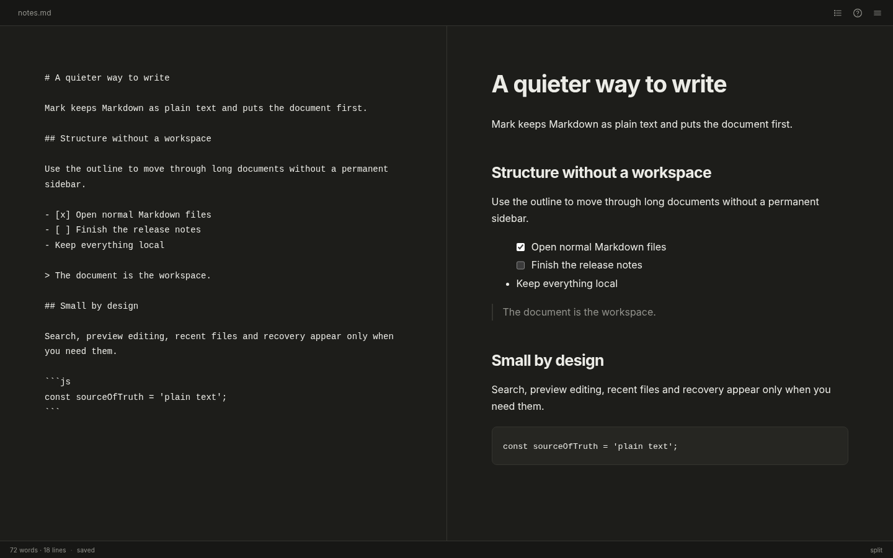
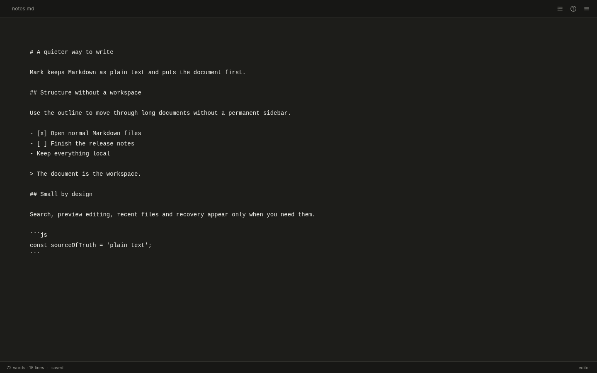
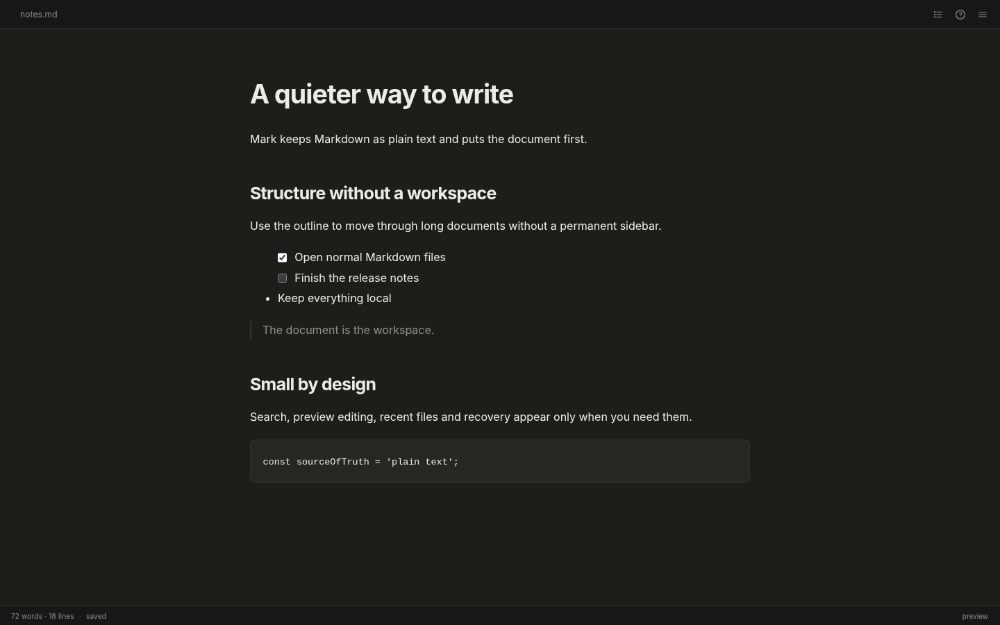
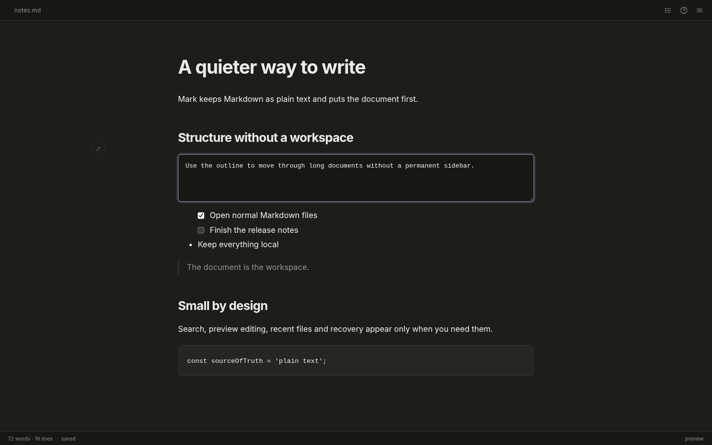
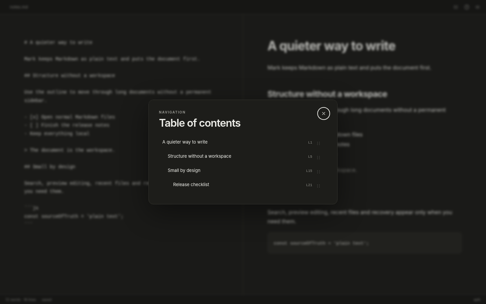

# Mark

**A quiet, local-first Markdown editor for long documents.**

<p align="center">
  
</p>

Mark is a desktop Markdown editor for Windows, macOS, and Linux. It keeps plain text as the source of truth and adds only the tools that make writing, reading, and navigating a document easier: live preview, search, an on-demand outline, recovery, and native file handling.

No account. No proprietary document format. No telemetry. No workspace to maintain.

## At a glance

### Three views, one document

<table>
  <tr>
    <td width="33%"><strong>Editor</strong></td>
    <td width="33%"><strong>Split</strong></td>
    <td width="33%"><strong>Preview</strong></td>
  </tr>
  <tr>
    <td></td>
    <td></td>
    <td></td>
  </tr>
</table>

### Edit the source without leaving the preview

Hover a rendered block and use the small pencil control to edit its Markdown source in place. Mark never converts the document into a proprietary rich-text model.

<p align="center">
  
</p>

### Structure without a permanent sidebar

The table of contents is generated from headings only when you ask for it. Jump to a section, or drag a heading to move that complete section in the source document.

<p align="center">
  
</p>

## Design principles

### Quiet by default

The document gets the screen. Advanced controls stay out of the way until they are useful: the outline opens on demand, preview editing appears on hover, and find / replace lives behind standard keyboard shortcuts.

### Structure without a workspace

Headings become an instant table of contents. Use it to move through long documents or reorder complete sections without introducing a project database, sidebar hierarchy, or separate document model.

### Plain files stay plain

Markdown remains the source of truth. Mark reads and writes normal files on disk, supports drag and drop, recent files, native file associations, and deliberate multi-window behavior.

## Features

- editor, split, and preview modes;
- live GitHub-Flavored Markdown preview;
- on-demand table of contents with section navigation and reordering;
- find and replace with highlighted preview matches;
- clickable task checkboxes that update the Markdown source;
- block-level editing from the preview without converting the document to rich text;
- recent files and native drag-and-drop opening;
- recovery copies for unsaved changes while explicit Save remains authoritative;
- automatic English / French UI selection from the system locale;
- light and dark appearance following the operating system;
- native menus, dialogs, multi-window handling, and Markdown file associations.

## Install

Release artifacts are attached to [GitHub Releases](https://github.com/bemorin/mark/releases).

### Windows

Download the latest installer from [Releases](https://github.com/bemorin/mark/releases) and run the setup.

The installer registers Markdown file associations. Windows still lets the user choose which application is the default for a file type.

To make Mark the default app for `.md` files:

1. Right-click any `.md` file.
2. Choose **Open with** → **Choose another app**.
3. Select **Mark**.
4. Choose **Always** / **Always use this app to open .md files**.

Mark also registers `.markdown`, `.mdown`, and `.mkd` as Markdown document types. A portable Windows build can be produced separately.

### macOS

Mark can be built for macOS as a `.dmg` and `.zip`.

To make Mark the default app for Markdown files, select a `.md` file in Finder, choose **Get Info**, select **Mark** under **Open with**, then choose **Change All**.

Public macOS binaries are not currently signed or notarized, so Gatekeeper may warn when opening an unsigned build. The source can be built locally without an Apple Developer Program membership.

### Ubuntu / Debian

Download the latest `.deb` from [Releases](https://github.com/bemorin/mark/releases) and install it.

An AppImage is also generated for portable use. Most Linux desktop environments let you make Mark the default for `.md` files from the file manager's **Open With** or **Properties** dialog.

## Build from source

Requirements:

- Node.js 22 or newer;
- npm;
- the target operating system for platform-native packaging.

```bash
npm install
npm run check
npm start
```

The first `npm install` creates `package-lock.json`. Commit that lockfile; do not commit `node_modules/`.

Create release artifacts with:

```bash
npm run dist:win
npm run dist:mac
npm run dist:linux
```

Convenience scripts are included:

```text
scripts/build-windows.bat
scripts/build-windows-portable.bat
scripts/build-mac.command
scripts/build-linux.sh
```

A universal macOS build can be requested with:

```bash
npm run dist:mac:universal
```

Build output is written to `release/` and is excluded from version control.

## Keyboard shortcuts

| Action | Shortcut |
| --- | --- |
| New | `Ctrl/⌘ + N` |
| Open | `Ctrl/⌘ + O` |
| Save | `Ctrl/⌘ + S` |
| Save as | `Ctrl/⌘ + Shift + S` |
| Find | `Ctrl/⌘ + F` |
| Find and replace | `Ctrl/⌘ + H` |
| Editor / Split / Preview | `Ctrl/⌘ + 1 / 2 / 3` |
| Table of contents | `Ctrl/⌘ + Shift + T` |
| Toggle menu bar | `Ctrl/⌘ + Shift + M` |
| Help | `Ctrl/⌘ + /` |

Formatting shortcuts include bold, italic, links, code, and indentation. The in-app help panel contains the full reference.

## Architecture

Mark intentionally keeps the desktop architecture small:

- **Main process** — windows, native menus and dialogs, filesystem operations, recent files, recovery, and OS link handling.
- **Preload bridge** — a narrow `contextBridge` API; the renderer does not receive direct Node.js or filesystem access.
- **Renderer** — editor state, preview, search, outline, block editing, and UI interactions.
- **Markdown pipeline** — Marked parses source, DOMPurify sanitizes the rendered HTML, then Mark adds interactions to the safe DOM.

Runtime dependencies are limited to **Marked** and **DOMPurify**. Electron and electron-builder are development and packaging dependencies.

## Lightweight, deliberately defined

Mark optimizes for a small product surface and a narrow dependency graph rather than pretending Electron has a native-size binary footprint. There is no account system, sync engine, plugin runtime, database, analytics SDK, or background service.

The Electron shell is a deliberate tradeoff for consistent desktop behavior across three operating systems. Installer size, startup time, idle CPU, memory use, and large-document responsiveness are treated as performance constraints and should be measured before making optimization claims.

## Security model

Markdown files are treated as untrusted input. The renderer runs sandboxed with Node.js integration disabled and context isolation enabled. Privileged IPC calls validate their sender, unexpected navigation and permission requests are blocked, and rendered Markdown is sanitized before insertion into the preview.

Web links are delegated to the operating system. Local filesystem operations remain in the main process, and executable/script links from documents are blocked.

If you find a security issue, see [SECURITY.md](SECURITY.md).

## Engineering notes

[Engineering decisions](docs/engineering-decisions.md) document a few product and technical tradeoffs using a consistent format: **Problem → Decision → Alternative rejected → Tradeoff → What I'd change now**.

The goal is not to turn a small app into an architecture textbook. It is to make consequential judgment inspectable.

## Repository checks

Run:

```bash
npm run check
```

The check validates JavaScript syntax, required repository files, exact dependency pins, expected application identity, and basic repository hygiene such as accidental credentials or personal absolute paths. The same check runs in GitHub Actions.

## Contributing

Focused contributions are welcome. Read [CONTRIBUTING.md](CONTRIBUTING.md) before opening a pull request.

Public release history lives in [CHANGELOG.md](CHANGELOG.md). Pre-public development iterations are intentionally not included.

## License

Mark is available under the [MIT License](LICENSE).
